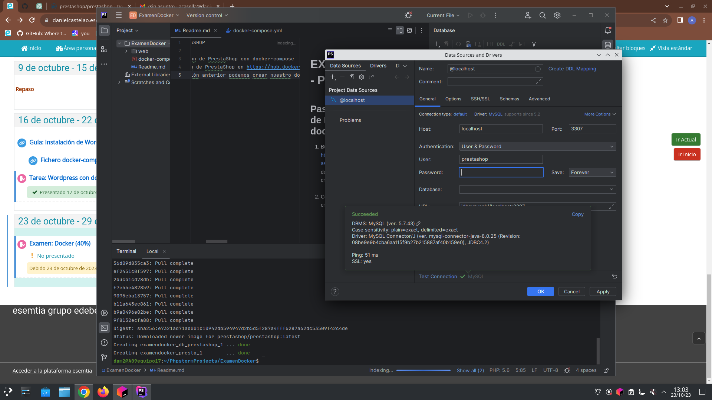
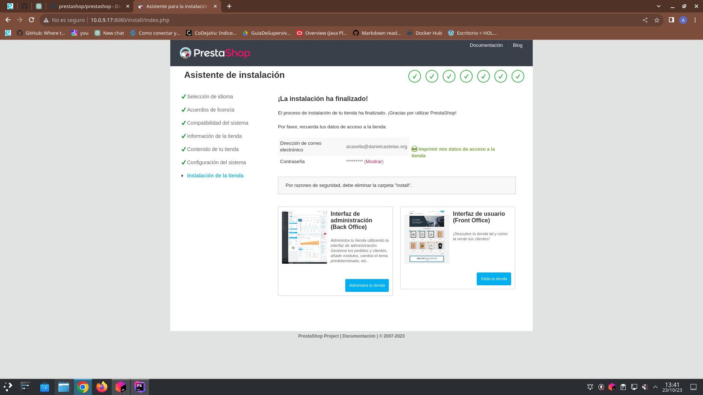
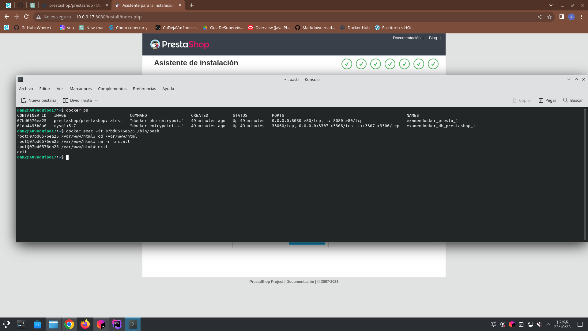
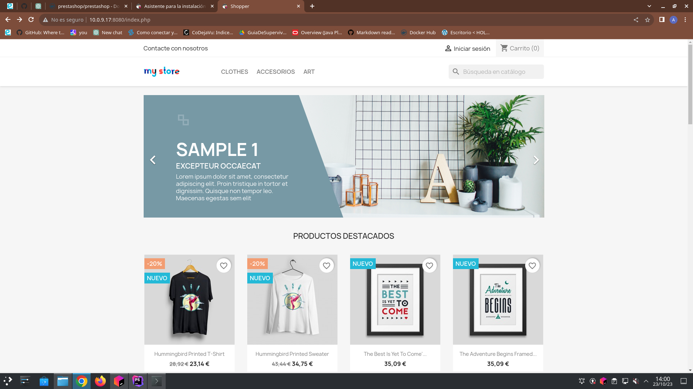

# EXAMEN DOCKER - PRESTASHOP

## Pasos para Instalación de PrestaShop con docker-compose
1. Buscar la información de PrestaShop en https://hub.docker.com/r/prestashop/prestashop/ <br>donde tendremos la información de cómo crear el documento .yml<br><br>
2. Con toda la información anterior podemos crear nuestro docker-compose.yml<br><br>
3. Esta configuración de Docker Compose permite ejecutar PrestaShop junto con una base de datos MySQL en contenedores Docker. <br>A continuación, explicaré las partes más importantes del archivo:<br>
    ```
    version: '3'
    ```
   Esta línea indica la versión de la sintaxis de Docker Compose que se está utilizando.
    ```
    services:
    ```
   La sección **services** es donde se definen los servicios de contenedores que se ejecutarán como parte de esta aplicación.
    ```
    prestashop:
       image: prestashop/prestashop:1.7
       ports:
          - "8080:80"
    ```
    **prestashop** es el nombre del servicio de PrestaShop.<br>
    **image** especifica la imagen Docker a utilizar, en este caso, se utiliza la imagen oficial de PrestaShop versión 1.7.<br>
    **ports** indica que el puerto 80 del contenedor se mapea al puerto 8080 del host. Esto significa que PrestaShop será accesible en http://localhost:8080.
    ```
    environment:
      - DB_SERVER=prestashop-db
      - DB_USER=prestashop
      - DB_PASSWD=prestashop
      - DB_NAME=prestashop
    ```
   **environment** establece las variables de entorno necesarias para la configuración de PrestaShop. PrestaShop necesita conocer la información de la base de datos, 
   como la dirección del servidor (DB_SERVER), el usuario de la base de datos (DB_USER), la contraseña (DB_PASSWD) y el nombre de la base de datos (DB_NAME).
    ```
    depends_on:
      - prestashop-db
    ```
   **depends_on** asegura que el servicio de PrestaShop se inicie después de que el servicio de la base de datos (prestashop-db) esté en funcionamiento. Esto garantiza 
   que la base de datos esté disponible cuando PrestaShop se inicie.
    ```
    volumes:
      - prestashop-data:/var/www/html
    ```
   **volumes** permite montar un volumen llamado prestashop-data en el directorio /var/www/html del contenedor de PrestaShop. Esto se utiliza para persistir los datos de 
   PrestaShop, como archivos, configuraciones, etc.
   ```
   prestashop-db:
    image: mysql:5.7
   ```
   **prestashop-db** es el nombre del servicio de la base de datos. Se utiliza la imagen oficial de MySQL versión 5.7 para la base de datos.
   ```
   environment:
      - MYSQL_ROOT_PASSWORD=root_password
      - MYSQL_USER=prestashop
      - MYSQL_PASSWORD=prestashop
      - MYSQL_DATABASE=prestashop
   ```
   Al igual que con PrestaShop, se configuran variables de entorno para la base de datos, incluyendo la contraseña del usuario root (MYSQL_ROOT_PASSWORD), 
   el nombre de usuario de la base de datos (MYSQL_USER), la contraseña (MYSQL_PASSWORD) y el nombre de la base de datos (MYSQL_DATABASE).
   ```
   volumes:
      - mysql-data:/var/lib/mysql
   ```
   Similar a PrestaShop, un volumen llamado mysql-data se monta en el directorio /var/lib/mysql del contenedor de la base de datos para persistir los datos de la base de datos.
   ```
   volumes:
      prestashop-data:
      mysql-data:
   ```
   Finalmente, se definen los volúmenes prestashop-data y mysql-data que se utilizan para persistir los datos de PrestaShop y la base de datos.<br><br>
   En resumen, este archivo docker-compose.yml configura dos servicios: uno para PrestaShop y otro para la base de datos MySQL. Estos servicios se comunican entre sí para permitir 
   que PrestaShop funcione con una base de datos persistente. Al ejecutar docker-compose up -d, se crearán y pondrán en marcha los contenedores, permitiéndote acceder a una tienda 
   PrestaShop en http://localhost:8080. Asegúrate de ajustar las contraseñas y otros detalles de configuración según tus necesidades antes de utilizarlo en un entorno de producción.<br><br>
4. Para lanzarlo en la terminal se escribe el siguiente comando:
   ``docker compose up -d``
<br><br>
5. Comprobación de la conexión a la base de datos:
   
<br><br>
6. Para probarlo se debe colocar en el buscador web: localhost:80 o mi ip (http://10.0.9.17:8080)

## Ejemplo:
1. Instalación del PrestaShop:
   

2. Eliminar la carpeta install del contenedor Prestashop para poder continuar
   

3. Tienda Online (Shopper) funcionando:
   